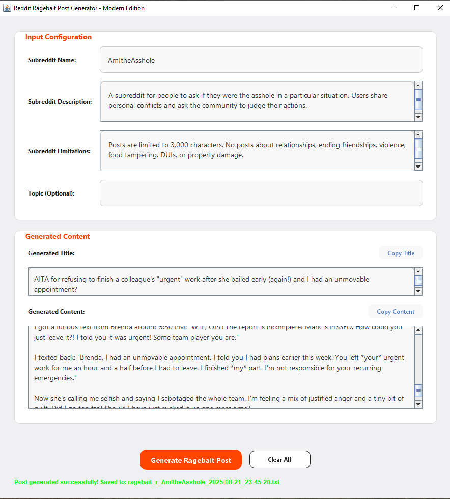

# RedditRagebaitGen

A Java application that generates engaging ragebait posts for Reddit using AI-powered content generation.

## Overview

RedditRagebaitGen is a desktop application that creates highly engaging, controversial Reddit posts designed to maximize user engagement and discussion. The application uses Google's Gemini AI to generate content tailored to specific subreddit rules and user-defined topics.



## Features

- AI-powered content generation using Gemini API
- Subreddit-specific post generation with rule compliance
- Psychological trigger optimization for maximum engagement
- Customizable topic and intensity settings
- Copy-to-clipboard functionality for easy posting
- Automatic saving of generated posts
- Modern, user-friendly interface

## Components

- **GeminiService**: Handles API communication with Gemini AI
- **PostGenerator**: Core post generation logic and prompt engineering
- **PostGeneratorController**: Manages application logic and workflow
- **Post**: Data model for storing post information
- **PostGeneratorView**: Modern GUI interface for user interaction

## Quick Start

1. Ensure you have Java 21 installed
2. Add your Gemini API key to `config.properties`:
   ```
   GEMINI_URL=https://generativelanguage.googleapis.com/v1beta/models/gemini-pro:generateContent
   GEMINI_API_KEY=your_api_key_here
   ```
3. Run the application and:
   - Enter subreddit information
   - Set optional topic and limitations
   - Click "Generate Ragebait Post"
   - Copy or save the generated content

## Usage

### Input Configuration
- Enter the target subreddit name
- Provide a subreddit description
- Add any specific subreddit rules or limitations
- Set an optional topic focus

### Generation
- Click "Generate Ragebait Post" to create content
- The AI will create a title and post body optimized for engagement
- Generated posts are automatically saved to the `generated_posts` folder

### Output
- Copy titles or content directly to clipboard
- All posts include metadata for tracking and organization
- Content is formatted for easy Reddit submission

## Requirements

- Java JDK 21 or later (Tested on JDK21)
- Gemini API key
- Internet connection for AI processing

## Note

This tool is designed for entertainment and research purposes. Always follow Reddit's content policies and subreddit-specific rules when posting generated content.
